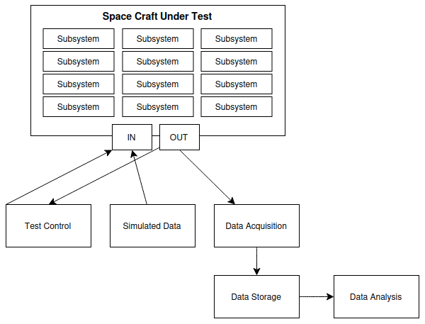

# Daedalus
Simulation testing framework for space crafts.

## Purpose
Daedalus is a framework meant to manage the complicated task of testing complicated space flight systems.

## Overview


## CAN Usage

### Set-up Proc
Install can-utils
```
sudo apt install can-utils
```

Load VCAN
```
sudo modprobe vcan
```

Add virtual netwrok interface
```
sudo ip link add dev vcan0 type vcan
```

Bring up the interface:
```
sudo ip link set up vcan0
```

Generate random CAN traffic
```
cangen vcan0
```

Monitor the trafiic
```
candump vcan0
```